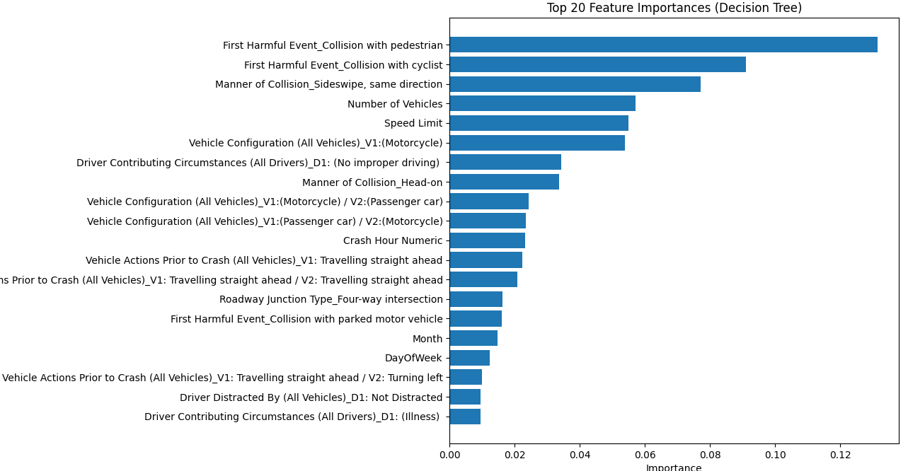

# CS 506 Midterm Report

## Project Overview
This project aims to investigate the relationship between weather conditions, driver age, and the occurrence of traffic accidents. By analyzing how different weather conditions affect various age groups and influence the frequency and severity of accidents, we aim to uncover patterns and risk factors that can be used to improve road safety. The insights derived from this analysis will support transportation authorities, policymakers, and the public in developing targeted, preventive safety measures, particularly during adverse weather conditions.

## Preliminary visualizations of data.
Visualizations help us identify key trends and correlations in crash data, such as the effects of time, weather, speed, and road conditions on crash severity and frequency. This analysis is useful for developing targeted safety measures or driving policies. Below are some of our initial visualization results.
- **Distribution of Crash Severity**: The majority of crashes fall in the “Property damage only category”, significantly outnumbering other types. As a matter of fact, property damage takes up 75.71%, with non-fatal 24.04% and fatal injury only 0.25% of the total data. Therefore we would expect our prediction baseline to be 75.71%, and we need to improve the accuracy to be at least higher than this number.
   

  

- **Speed Limit by Crash Severity**: The data indicates a general trend that as the speed limit increases, the severity of crashes also tends to increase. Higher speed limits are associated with a greater likelihood of injuries, and especially fatalities. 
   

  

- **Driver Age Distribution by Crash Severity**: Property damage only bars are distributed across all age groups, with peaks particularly around ages 20-30, indicating that younger age ranges have higher frequency of property damage accidents compared with other age groups. Non-fatal injuries are also more common among the younger drivers, especially around ages 20-30, suggesting that younger drivers may be more prone to accidents that lead to injuries. Fatal injuries, although rare, are slightly more prevalent among the age 20 and 40. This condition might be due to inexperience among young drivers. In this case, younger drivers should be more cautious and be trained to reduce the risk of accidents. 

  

- **Proportion of Crash Severity by Weather Conditions**: Across all weather conditions, the majority of crashes result in property damage without injuries. This is consistent across both favorable and adverse conditions. The fatal injury happens much more significantly in fog/smog conditions compared to others, which are barely visible on this graph(though they do exist for each weather condition). Interestingly, severe winds and snow actually have a higher proportion of no-injury accidents, which was not expected since they are considered worse weather conditions. It might be because people are actually driving more slowly and carefully in bad weather.

  

## Detailed description of data processing done so far.
Originally, we had planned to predict the severity of traffic accidents based upon only a few factors like weather conditions and age of drivers. But then we realized that these factors alone do not provide enough prediction accuracy as we assumed they would, therefore, we introduced many more factors into the dataset, and tried to pinpoint which features are most relevant in predicting the severity of accidents. All these additional factors can be pulled from the MASSDOT website which provides very detailed crash reports. Now it comes down to these features:

  

  

Of all these features, some of the records are not very standard. For example in the weather condition column, we would see notations like clear/cloudy, snow/cloudy or even clear/clear, which are all very confusing. Therefore, we preprocessed some of the records to make them cleaner and easier to interpret with methods like this:

  

Do note that these are just preliminary data processing, which we will focus on enhancing later. 

## Detailed description of data modeling methods used so far.
For our preliminary modeling, we focused on three classifiers: Logistic Regression, Decision Tree, and XGBoost. Each model was evaluated on its ability to predict crash severity, which was encoded into numerical labels. 

For each classifier, we divided the dataset into an 80% training set and a 20% test set. Metrics such as accuracy, precision, recall, and F1-score were computed, focusing on each class (Fatal injury, Non-fatal injury, Property damage only). 

The XGBoost model performed well, with a high recall for the “Property damage only” class, though it struggled with minority classes like “Fatal injury.” We explored feature importance in tree-based models (Decision Tree and XGBoost) to understand which attributes had the most significant impact on predictions.

Preliminary results. (e.g. we fit a linear model to the data and we achieve promising results, or we did some clustering and we notice a clear pattern in the data)

Logistic Regression Result:

The logistic regression model’s performance on the test set:

  

The model performs well in identifying “Property Damage Only” cases, achieving high precision and recall. However, it struggles with the “Fatal Injury” category, where both precision and recall are zero due to the model’s difficulty in capturing this minority class.

  

In the linear regression case, most important features are collision with pedestrian and vulnerable users, and whether or not motorcycles are involved. These features seem to make sense because the people involved are not well protected, but we aim to find more useful features with more in depth research. 

Decision Tree Result:

  

Performance by Class:  When we don’t set the max_depth,  decision trees might still create complex splits, making them sensitive to noise and outliers. This could result in lower accuracy on test data. Therefore here we set max_depth to 15 to achieve a good accuracy.
The model heavily favors Property damage (the majority class), resulting in many Class 1 (Non-fatal Injury) instances being misclassified as Class 2 (Property damage). This is a common issue with imbalanced datasets, where the model learns to predict the majority class more accurately but struggles with minority classes.The model failed to correctly classify any instances of Fatal Injury, which has very low representation. This is a strong indicator that the model might benefit from techniques to handle class imbalance, such as resampling or adjusting class weights

Feature Importance Analysis:

  

Below are the top three features that had the greatest impact on the results:
First Harmful Event - Collision with Pedestrian: This feature is the most influential in predicting crash severity, indicating that collisions with pedestrians tend to significantly impact severity levels due to the vulnerability of pedestrians in crashes.
First Harmful Event - Collision with Cyclist: This feature ranks second, showing that crashes involving cyclists also greatly influence severity. Like pedestrians, cyclists are vulnerable road users, making these types of collisions potentially severe.
Manner of Collision - Sideswipe, Same Direction: This feature is important for distinguishing crash severity, as certain collision types, like sideswipes, can vary in severity depending on speed and angle, impacting the potential for injury or damage.

XGBoost Model Result:

  

Performance by Class: The model showed high performance in predicting the “Property damage only” class but struggled to accurately predict “Fatal injury” cases due to class imbalance.

The matrix shows that most predictions fall into the “Property damage only” category, indicating a need for further adjustments to improve minority class predictions.
Feature Importance Analysis:

  

Using XGBoost’s feature importance scores, we identified key predictors of crash severity:

- **Top Features**: 
  - First Harmful Event (such as collisions with parked vehicles, cyclists, or pedestrians) and Road Surface Condition (like snowy conditions) were among the top features affecting the model’s decisions.

- **Impact of Driver Actions and Vehicle Configurations**:
  - Variables like Manner of Collision, Driver Contributing Circumstances, and Vehicle Configuration also ranked highly, suggesting the importance of situational factors in determining crash severity.

This preliminary modeling and analysis offered insights into relationships between features and crash outcomes, with early findings suggesting that environmental conditions and collision types play significant roles in determining the severity of crashes.

## Next Steps
To improve upon these preliminary findings and complete the project goals, the following steps are planned:

1. **Additional Modeling Approaches**:  
So far, we have tested logistic regression, decision trees, and XGBoost. We plan to explore MLP and other deep learning models to capture more complex patterns in the data to  improve prediction accuracy.

2. **Key Risk Factor Identification**:  
A comprehensive analysis of key risk factors is still pending. The original proposal aimed to identify which weather conditions and age groups most significantly contribute to the severity of accidents, but now we have many more other features that can help us in predicting the severity and we need to work on that to find the most relevant features.

3. **Enhanced Data Visualization**:  
While some preliminary visualizations have been created, the proposal outlined more in-depth data visualizations, such as heatmaps, correlation matrices, and trend analyses. These visualizations will be developed later to better illustrate all the relationships within the dataset.
