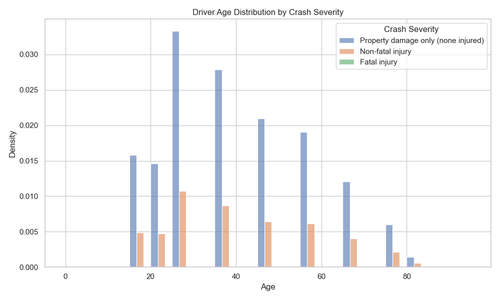
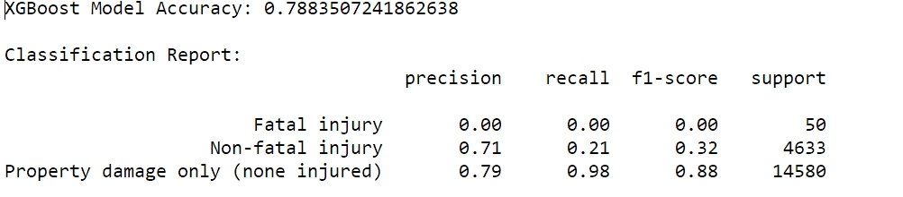

<h1 style="text-align: center;">CS 506 Final Report</h1>

<strong>Author:</strong> Xulun Huang, Luying Ruan, Yuzhe Wu 

**1. Project Overview**

This project aims to investigate the relationship among weather
conditions, lighting conditions, driver age, collision type and other
factors that influence the severity of traffic accidents. By analyzing
these different factors, we aim to uncover patterns that can be used to
improve road safety. The insights derived from this analysis will
support transportation authorities, policymakers, and the public in
developing targeted, preventive safety measures, particularly during
adverse weather conditions.

**2. Data Collection**

The primary sources for traffic accident data will be government
databases, specifically MassDOT. The government database has
comprehensive information about traffic accidents, including date and
time, location, weather conditions, lighting conditions, driver age,
severity of accident and more, which encapsulates all the categories of
data we need.

**3. Visualizations of data.**

Visualizations help us identify key trends and correlations in crash
data, such as the effects of time, weather, speed, and road conditions
on crash severity and frequency. This analysis is useful for developing
targeted safety measures or driving policies. Below are some of our
visualization results.

**Distribution of Crash Severity:**

There are in total three types of severity measurement in the government
dataset: " Property Damage Only", "Non-fatal injury" and "Fatal injury".
The majority of crashes fall in the "Property damage only",
significantly outnumbering other types. As a matter of fact, property
damage takes up 75.71%, with non-fatal 24.04% and fatal injury only
0.25% of the total data. Therefore we would expect our prediction
baseline to be 75.71%. The goal of a "good" model would be to predict
with an accuracy which is at least higher than this number.

**Speed Limit by Crash Severity:**

The data indicates a general trend that as the speed limit increases,
the severity of crashes also tends to increase. Higher speed limits are
associated with a greater likelihood of injuries, and especially
fatalities. There are of course, outliers in both "property damage" as
well as "non-fatal" severities, but the middle fifty percentile does
show a clear trend.

**Driver Age Distribution by Crash Severity：**

Property damage only bars are distributed across all age groups, with
peaks particularly around ages 20-30, indicating that younger age ranges
have higher frequency of property damage accidents compared with other
age groups. Non-fatal injuries are also more common among the younger
drivers, especially around ages 20-30, suggesting that younger drivers
may be more prone to accidents that lead to injuries. Fatal injuries,
although rare, are slightly more prevalent among the age 20 and 40. This
condition might be due to inexperience among young drivers. In this
case, younger drivers should be more cautious and be trained to reduce
the risk of accidents.

**Proportion of Crash Severity by Weather Conditions:**

Across all weather conditions, the majority of crashes result in
property damage without injuries. This is consistent across both
favorable and adverse conditions. The fatal injury happens much more
significantly in fog/smog conditions compared to others, which are
barely visible on this graph(though they do exist for each weather
condition). Interestingly, severe winds and snow actually have a higher
proportion of no-injury accidents, which was not expected since they are
considered worse weather conditions. It might be because people are
actually driving more slowly and carefully in bad weather.

**4. Detailed description of data processing.**

Originally, we had planned to predict the severity of traffic accidents
based upon only a few factors like weather conditions and age of
drivers. But then we realized that these factors alone do not provide
enough prediction accuracy as we assumed they would, therefore, we
introduced many more factors into the dataset, and tried to pinpoint
which features are most relevant in predicting the severity of
accidents. All these additional factors can be pulled from the MASSDOT
website. Now we have selected the following features for
prediction:

Of all these features, some of the records are not very standard. For
example in the weather condition column, we would see notations like
clear/cloudy, snow/cloudy or even clear/clear, which are all very
confusing. Therefore, we preprocessed some of the records to make them
cleaner and easier to interpret with methods like
this:

**5. Detailed description of data modeling methods.**

For our modeling, we utilize: **Logistic Regression**, **Decision
Tree**, **XGBoost, MLP, TabNet**. Each model was evaluated on its
ability to predict crash severity, which was encoded into numerical
labels.

For each classifier, we divided the dataset into an 80% training set and
a 20% test set. We used one hot encoding for each categorical feature,
and used a standard scaler for each numerical feature. Accuracy,
precision, recall, and F1-score were computed as metrics, focusing on
each class (Fatal injury, Non-fatal injury, Property damage only).

1.  **Logistic Regression Result**

> The logistic regression model's performance on the test set:
>
> 
>
> The model performs well in identifying "Property Damage Only" cases,
> achieving high precision and recall. However, it struggles with the
> "Fatal Injury" category, where both precision and recall are zero due
> to the model's difficulty in capturing this minority class.
>
> 
>
> In the linear regression case, most important features are collision
> with pedestrian and vulnerable users, and whether or not motorcycles
> are involved. These features seem to make sense because the people
> involved are not well protected, but we aim to find more useful
> features with more in depth research.

2.  **Decision Tree Result**

> 
>
> Performance by Class: When we don't set the max_depth, decision trees
> might still create complex splits, making them sensitive to noise and
> outliers. This could result in lower accuracy on test data. Therefore
> here we set max_depth to 15 to achieve a good accuracy.
>
> Feature Importance Analysis:
>
> 
>
> Top features selected seem to align with the results we get from
> logistic regression before, which are
>
> different collision types with an additional factor of speed limit.

3.  **XGBoost Model Result**

**Feature Importance Analysis**

Top features for XGBoost align well with the previous two methods, which
are different collision types and in this case an additional feature
road_surface_snow.

4.  **MLP**

We applied the MLP and tried to capture more complex patterns in the
data to improve prediction accuracy. Below is the structure of MLP:

**Structure of MLP**

The implemented neural network is a fully connected feedforward model
(Multilayer Perceptron, MLP) for potentially better prediction results.

The input layer receives a transformed, high-dimensional feature vector.
We applied the same one hot encoding and standard scaler to the features
before training. The exact input dimension corresponds to the number of
processed features.

The first hidden layer with 256 neurons is applied, using a ReLU
(Rectified Linear Unit) activation function. L2 regularization is
employed to mitigate overfitting, encouraging the network to learn more
robust weight patterns. This layer is followed by batch normalization,
which normalizes intermediate activations and helps stabilize training,
and dropout at a rate of 30%, which randomly disables a proportion of
neurons during training to reduce overfitting and improve
generalization. The second hidden layer with 128 neurons, also using
ReLU activation and L2 regularization. The third hidden layer with 64
neurons follows the same pattern, using ReLU activation, L2
regularization, batch normalization, and dropout.

The output layer outputs a vector whose dimensionality matches the
number of severity classes. A softmax activation function converts the
layer's raw logits into class probabilities.

**Training Procedure and Optimization**

The network is trained using the sparse categorical cross-entropy loss,
which is well-suited for multi-class classification tasks and directly
compares the predicted probabilities against the true class labels. The
training process employs Stochastic Gradient Descent (SGD) with momentum
to update weights iteratively. While SGD provides a theoretically sound
optimization approach, momentum helps accelerate convergence and
stabilize the trajectory in parameter space. A modest initial learning
rate (0.001) is chosen, and a learning rate reduction scheduler
(ReduceLROnPlateau) further refines the learning rate over time based on
validation performance. Early stopping monitors validation loss and
halts training when improvements plateau, ensuring the model generalizes
well to unseen data. This approach prevents unnecessary computation and
overfitting to the training set.

**Result of MLP**

MLP model accuracy is 0.7829. The F-1 score of Fatal injury is 0.04,
which means that the model fails to generalize to this critical yet rare
class. However, it was able to correctly predict one of the 51
instances, something not achieved within our other models. The model's
precision (0.65) and recall (0.25) for non-fatal injuries are both
modest.

**Training and Validation**

The training accuracy steadily increases across epochs and continues to
improve up to the final epoch. The validation accuracy closely follows
the training accuracy but stabilizes earlier and shows slight
fluctuations. The close alignment between training and validation
accuracies indicates the model is not overfitting.

The losses stabilize after about 10 epochs and remain almost constant
for the remaining epochs. By stopping early, there is no overfitting, as
the validation loss closely follows the training loss.

5.  **TabNet**

> TabNet is an advanced deep learning architecture specifically designed
> for tabular data. It leverages a sparse attention mechanism that
> allows the model to focus on the most relevant features dynamically,
> which is particularly effective for datasets with mixed feature types,
> such as traffic accident data. Unlike traditional models, TabNet can
> process both categorical and numerical data directly. TabNet's
> capacity to handle nonlinear interactions between features and its
> support for large-scale datasets make it a powerful choice for
> predicting accident severity and uncovering the key factors.

**Accuracy:**

**Confusion Matrix Heatmap:**

> The confusion matrix heatmap demonstrates strong performance in
> predicting the "Property Damage Only" category, where the majority of
> samples are correctly classified but struggles to accurately predict
> the "Fatal" category just like all the methods used before.
>
> **Feature Importance Analysis:**
>
> The feature importance results provided by TabNet highlight the
> factors influencing crash severity:
>
> 1\. Top Features:
>
> First Harmful Event: This feature stands out as the most influential,
> indicating that the nature of the initial impact plays a crucial role
> in determining the severity of crashes. It reflects the direct
> consequence of crash dynamics.
>
> Speed Limit: The second most important feature suggests that higher
> speed limits are strongly correlated with more severe crashes,
> emphasizing the role of velocity in impact energy and accident
> outcomes.
>
> Manner of Collision: This feature captures the configuration of the
> crash (e.g., head-on, rear-end), which is critical for assessing the
> severity of injuries or damages.
>
> 2\. Secondary Features:
>
> Age of Driver - Oldest Known and Number of Vehicles are moderately
> important, indicating that older drivers and multi-vehicle accidents
> contribute significantly to crash outcomes.
>
> Features like First Harmful Event Location and City Town Name provide
> contextual information but have slightly lower predictive power
> compared to top features.
>
> 3\. Low-Importance Features:
>
> Features like Traffic Control Device Type and Vehicle Emergency Use
> showed minimal importance. This could be due to limited variation in
> these features or their weak correlation with accident severity in the
> dataset.
>
> The feature importance analysis underscores TabNet's ability to focus
> on the most impactful factors while deprioritizing less relevant
> features, enhancing both predictive performance and model
> interpretability.

**6. Conclusion**

This project investigated the relationship between various
factors---such as weather conditions, lighting conditions, driver age,
speed limits, and collision types---and the severity of traffic
accidents. By leveraging government-provided traffic accident data, we
employed a range of data processing and machine learning techniques to
identify key patterns and predictive features. Through detailed modeling
efforts with Logistic Regression, Decision Tree, XGBoost, MLP, and
TabNet, we gained valuable insights into the factors influencing crash
outcomes.

Our analysis revealed several consistent trends. Features like speed
limits, collision types, and the involvement of vulnerable road users
(e.g., pedestrians and motorcyclists) were strong predictors of accident
severity across all models. Younger drivers, particularly those aged
20--30, were more likely to be involved in property damage and non-fatal
accidents, while adverse weather conditions like fog and smog showed a
notable correlation with fatal injuries. Interestingly, contrary to
expectations, severe weather conditions like snow and strong winds often
resulted in a higher proportion of no-injury accidents, likely due to
more cautious driving behaviors.

The models we have built achieved mostly the same level of accuracy,
from simple linear regression models to complex MLPs. This indicates
that the traffic data, though complicated, doesn't provide strong
correlation with the outcome of the severity of accidents. Although we
have not been able to achieve a high level of prediction accuracy, we do
learn that traffic accident severity can be quite random and doesn't
necessarily depend on specific weather or lighting or other hazardous
situations as we have assumed. But we are still able to identify risk
factors based on collision types and speed limit and sometimes road
surface conditions.

Overall, this project underscores the complexity of traffic accident
dynamics and the importance of multifactorial analysis. The insights
gained can inform transportation authorities and policymakers in
developing targeted interventions, such as stricter speed regulations,
better public awareness campaigns for young drivers, and improved
infrastructure for adverse weather conditions. Future work could focus
on expanding the dataset, exploring additional features, and refining
advanced models to enhance the prediction of rare but severe accident
outcomes. By continuing this line of research, we can contribute to
safer roads and more effective preventive measures.
